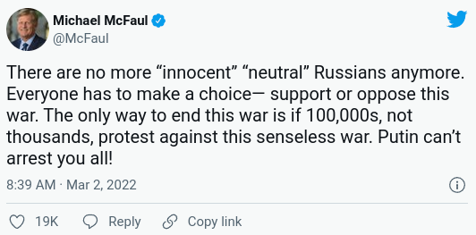

Somewhere near the bottom of the world's concerns last week was whether the
2022 International Congress of Mathematicians (ICM), scheduled to take place in
St. Petersburg this Summer, would continue as planned. There had been
a [proposed boycott](http://www.icm2022boycott.org/) since the location was
announced in 2018, but it was set to fail until last week. But then Russia
invaded Ukraine and the boycotters got their wish. [The 2022 ICM will take
place
online](https://www.mathunion.org/fileadmin/IMU/ICM2022/ICM_2022_statement.pdf),
effectively declaring Russia as unsuitable to host.

Moving the ICM from Russia was a good decision for the following reasons.

1. It is physically difficult to enter Russia from the West right now, it may
   get worse, and we have no idea when it will get better. Since [the European
   Union and the US closed their air space to Russian
   airlines](https://www.washingtonpost.com/transportation/2022/03/01/airspace-russia-ukraine/),
   the only way I see to get to St. Petersburg by air from New York is staying
   overnight in Turkey.

2. Russia may become more hostile to political dissent after the invasion. The
   Russian government is [already famously intolerant of
   dissent](https://en.wikipedia.org/wiki/Poisoning_of_Alexei_Navalny), but
   even countries with better track records do bad things during crises. Harsh
   sanctions and a gruelling war may be such a crisis for the Putin government.
   How many [signatories on the
   boycott](http://www.icm2022boycott.org/#signatories) are concerned about
   retribution?

However, I am worried about overstating the moral case here. Putin is doing
something bad, and we should discourage him. But the ICM has nothing to do with
that. The ICM has no power over anything in the countries it visits. Having the
meeting in Russia does not contribute to the bad things that Russia does, and
*not* having the meeting does not contribute to anything good. In this sense
the meeting is very low-stakes, which is why the reasons above are more than
enough to move it.

But the boycotters think there was a genuine moral case for moving the meeting.
They wrote the following before Russia invaded Ukraine:

> Under these circumstances, the decision of [the International Mathematical
Union] to hold the Congress in Russia demonstrates either moral indifference or
ignorance about the actions of Putin's regime.

If we apply this argument to everything Russia has any involvement in, no
matter how insignificant (and the ICM is insignificant!), then we should
boycott essentially everything and everyone from Russia.

Here is the former US ambassador to Russia, Michael McFaul, saying something
pretty close to this:

Here is Russian social scientist, Ilya Matveev, complaining about retributions
in academia:

<blockquote class="twitter-tweet">
I&#39;m so disgusted
with rejection letters, invitation cancellations, grant withdrawals etc.
against Russian scholars from Western academics who fight Putinism by attacking
those who have suffered from it for decades.
&mdash; Ilya Matveev
(@IlyaMatveev_) <a
href="https://twitter.com/IlyaMatveev_/status/1498404492009689091?ref_src=twsrc%5Etfw">February
28, 2022</a></blockquote> 

Here is the Glasgow Film Festival announcing the removal of two Russian films
seemingly because they are Russian:

<blockquote class="twitter-tweet">
A statement from
Glasgow Film Festival. <a
href="https://t.co/HjyYXhYPCJ">pic.twitter.com/HjyYXhYPCJ</a>
&mdash;
Glasgow Film Festival (@glasgowfilmfest) <a
href="https://twitter.com/glasgowfilmfest/status/1498315807176073219?ref_src=twsrc%5Etfw">February
28, 2022</a></blockquote> 

The Putin regime is doing something bad and we should discourage its behavior
with a broad range of actions. But everything we try---from something silly
like moving the ICM, to something serious like imposing new sanctions---might
escalate the current conflict. And as Matthew Yglesias [recently
wrote](https://www.slowboring.com/p/23-thoughts-on-the-war-in-ukraine?s=r), "We
can't just escalate and escalate. There has to be some goal in mind that counts
as a win and lets people back down." Shunning everything related to the Russian
government is not a sufficiently targeted goal.

Fortunately, the ICM is inconsequential and there were good reasons to move it
anyway. But I hope that our [newfound moral clarity about
Russia](https://noahpinion.substack.com/p/a-moment-of-clarity?s=r) does not go
too far. As much as possible, we want to stop the war in Ukraine *without*
hurting innocent people.
